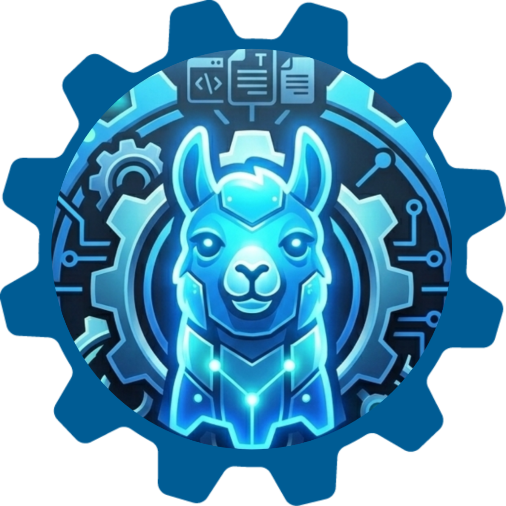

# ollama-forge

<p align="center">
  
</p>

<p align="center">
  <strong>Local AI Toolkit for Linux — 100% Offline, 100% Private</strong><br/>
  Ollama lifecycle management · PyQt5 desktop chat with RAG · AI-powered DevOps assistant
</p>

<p align="center">
  <a href="#quick-start">Quick Start</a> ·
  <a href="#ollama-main">ollama-main</a> ·
  <a href="#ollama-gui">Ollama GUI</a> ·
  <a href="#dev-assist">dev-assist</a> ·
  <a href="#architecture">Architecture</a> ·
  <a href="#development">Development</a>
</p>

---

## Overview

**ollama-forge** is a privacy-first, offline-first suite of three tightly integrated tools for running, managing, and working with local AI models on Linux. All compute stays on your machine — no cloud API calls, no telemetry, no data leaving your network.

The suite ships as standalone **PyInstaller single-file binaries** with no Python runtime or virtual environment required at deployment time.

| Component | Binary | Role |
|-----------|--------|------|
| [**ollama-main**](#ollama-main) | `ollama-main` | CLI lifecycle manager for the Ollama binary — install, upgrade, update-check, uninstall |
| [**Ollama GUI**](#ollama-gui) | `Ollama-ai-gui` · `Ollama-ai-manager` | Full-featured PyQt5 desktop chat with multi-model support, FAISS RAG, conversation history, crew multi-agent mode |
| [**dev-assist**](#dev-assist) | `da` | AI-powered DevOps assistant — terminal REPL + Chainlit web UI with semantic code RAG, shell execution, git helpers, tunnel management, and multi-provider AI |

Part of the [dev-boffin-io](https://github.com/dev-boffin-io) **Forge Suite** — privacy-first developer tooling for Linux.

---

## Requirements

- **OS:** Linux (Debian/Ubuntu primary; ARM64 and proot-Termux fully supported)
- **Python:** 3.10 or later (build time only — not required at runtime)
- **Ollama:** Must be installed and running for the GUI and dev-assist (`ollama serve`)
- **sudo:** Required for system dependency installation and CLI symlinks in `/usr/local/bin`

---

## Quick Start

```bash
# 1. Clone
git clone https://github.com/dev-boffin-io/ollama-forge.git
cd ollama-forge

# 2. Install system dependencies (ARM64/Debian — GUI build only)
sudo bash builder/install-deps-gui.sh

# 3. Build everything
make all

# 4. Install CLI symlinks + desktop entry
make install

# 5. Verify
ollama-main --help
da --help
```

After `make install`, **Ollama Forge** appears in your application menu and `ollama-main` / `da` are available as system-wide commands.

---

## ollama-main

`ollama-main` is a lightweight CLI tool that manages the Ollama binary lifecycle on any Linux system. It wraps the official [Ollama install script](https://ollama.com/install.sh) and adds version-aware upgrade logic with dual GitHub API endpoints for reliability.

### Commands

```bash
ollama-main install     # Install Ollama if not present
ollama-main upgrade     # Upgrade to the latest GitHub release
ollama-main update      # Check version status without installing
ollama-main uninstall   # Stop service, disable systemd unit, remove all paths
```

### How it works

**Version detection** queries the GitHub Releases API (`/repos/ollama/ollama/releases/latest`) with an automatic fallback to the list endpoint when rate limits apply. Versions are parsed with a regex that handles pre-release suffixes (`0.6.0-rc1`, `0.6.0-beta`) and compared using [`packaging.version`](https://packaging.pypa.io/) for correct semantic ordering.

**Uninstall** is comprehensive: it stops and disables the systemd service if active, removes all paths written by the official install script (`/usr/local/bin/ollama`, `/usr/local/lib/ollama`, `/usr/share/ollama`, `/etc/systemd/system/ollama.service*`), reloads the systemd daemon, and auto-detects whether `sudo` is needed based on the running UID.

### Dependencies

| Package | Role |
|---------|------|
| `requests >= 2.28` | GitHub API queries |
| `packaging >= 23.0` | Semantic version comparison |

---

## Ollama GUI

`Ollama-ai-gui` is a full-featured desktop chat application built with **PyQt5**. It communicates with a locally running Ollama server via its REST API, stores all conversation history in a local SQLite database, and provides a FAISS-backed RAG system for document-grounded answers — all without any cloud dependency or LangChain.

The companion window `Ollama-ai-manager` handles the operational side: Ollama service control, model management, authentication, and binary updates.

### Architecture

The GUI is split into six focused modules, each with a single responsibility:

```
gui/
├── main.py             Main window — layout, event wiring, theme
├── ollama_client.py    Ollama REST API client (streaming chat, model list, embed)
├── database.py         SQLite store — conversations, messages, crews
├── rag_engine.py       FAISS RAG — document loading, chunking, embedding, search
├── workers.py          QThread workers — DirectChat, CrewChat, RAGBuild
├── crew_dialogs.py     Crew configuration dialog + built-in templates
└── _syspath_patch.py   PyInstaller path fix (injects system site-packages)
```

All blocking operations — AI inference, document indexing, service polling — run in **QThread workers** and communicate back to the main thread exclusively through `pyqtSignal`. The UI never blocks.

### Chat and Conversation Management

The left panel provides a full conversation sidebar:

- **New Chat** creates a fresh conversation in SQLite with auto-generated titles.
- **Search** filters conversations in real time as you type, without a database round-trip.
- **Right-click context menu** on any conversation offers rename, pin/unpin, and delete. Pinned conversations always sort to the top.
- The chat area streams tokens from the model as they arrive, flushed to the UI at a **120 ms interval** to balance smoothness against syscall overhead.
- **Stop generation** is available at any point via a mutex-protected `is_running()` flag in the worker thread — checked between every token flush.

Conversation history is preserved across restarts. The full message list for the active conversation is sent to Ollama with every request, enabling genuine multi-turn context.

### RAG (Retrieval-Augmented Generation)

The RAG system is a from-scratch implementation using **FAISS** and **sentence-transformers** — no LangChain, no ChromaDB, no external vector database service.

#### Indexing pipeline

**1. File loading** — supports PDF (`pypdf`), DOCX (`python-docx`), and plain text/code (UTF-8 with error replacement). All loaders are lazy-imported; missing dependencies produce a clear install instruction rather than a cryptic traceback.

**2. Chunking** — word-based sliding window (500 words, 80-word overlap) producing semantically coherent passages while preserving cross-boundary context.

**3. Deduplication** — each file is MD5-hashed before processing. Files already present in the index are skipped instantly, making incremental re-indexing fast regardless of project size.

**4. Embedding** — two backends, selected automatically by model name:
  - **Ollama models** (names containing `:`, e.g. `nomic-embed-text:latest`) — calls `/api/embed` (Ollama ≥ 0.3 batch endpoint) with automatic fallback to the legacy `/api/embeddings` one-by-one endpoint. Batch size is set to 1 to keep cancellation instant.
  - **HuggingFace sentence-transformers** (e.g. `all-MiniLM-L6-v2`) — local inference with a module-level model cache to avoid reloading on repeated queries. Batch size 32 for throughput.
  - All embedding vectors are **L2-normalised** before storage so that inner-product similarity equals cosine similarity without a separate normalisation step at query time.

**5. Storage** — `faiss.IndexFlatIP` (inner product / cosine) persisted to `~/.ollama_gui/rag/` as `index.faiss` + `meta.json`. Metadata stores chunk text, source filename, and file hash for per-document removal.

**6. Cancellation** — a `stop_cb` callable is polled between batches; indexing halts cleanly mid-way without corrupting the persisted index.

#### Search

At query time, the query string is embedded with the same model used during indexing and a top-k inner-product search is run against the FAISS index. Retrieved chunk texts are injected into the Ollama prompt as numbered context sections with source filenames.

#### Per-document removal

FAISS flat indices do not support element deletion. When a document is removed, the engine rebuilds the entire index from the remaining chunks — re-embedding all of them fresh. This is a deliberate trade-off: operational simplicity over update performance. For typical RAG workloads (tens to low hundreds of documents) the rebuild completes in seconds.

#### Embedding model selector

The embed model combo box is populated with installed Ollama models filtered to embedding-capable ones, with `nomic-embed-text:latest` and `mxbai-embed-large:latest` as named fallbacks when no embed models are detected. The selected model is stored per-index; switching models after indexing requires re-indexing (the GUI warns about this with a dialog).

### Crew Mode — Multi-Agent Pipelines

Crew mode runs a **sequential multi-agent pipeline** where each agent is a separately configured model and system prompt, and the output of each agent becomes the input (`{previous}`) for the next.

#### Built-in templates

| Template | Agents |
|----------|--------|
| **Research Crew** | Researcher → Analyst → Report Writer |
| **Coding Crew** | Architect → Coder → Reviewer |
| **Writing Crew** | Outliner → Drafter → Editor |

Templates are starting points. Every field is fully editable: agent role name, model (dropdown from the live Ollama model list), system prompt, and the `input_prompt` template.

#### Execution

`CrewChatWorker` runs in a QThread. It iterates the agent list sequentially, calling `OllamaClient.chat_stream` for each, and emits streamed tokens to the UI labelled with the agent name and model in the format `**[N. Role — model]**`. The first agent also receives the last 6 user turns from the current conversation as prior context. The full pipeline output is assembled as a single structured markdown document (`# CREW REPORT`) and saved to the conversation history in SQLite.

#### Custom crews

The `CrewConfigDialog` presents a scrollable list of agent cards. Each card exposes model selector, role name, system prompt, and input prompt template fields. Crews are persisted in the `crews` SQLite table. One crew can be marked as the default, applied automatically to new conversations.

### Ollama Manager

`Ollama-ai-manager` is a standalone window for the operational side of Ollama. All blocking work runs in daemon threads or `QThread` workers with `pyqtSignal` for thread-safe UI updates. The auth, server state, and install state panels are fully independent and do not block each other.

**Service control:** Start/stop the `ollama serve` process directly from the UI, with real-time stdout/stderr streaming to an output panel via a `_SubprocWorker` that pipes process output line-by-line. A `QTimer` polls `GET /api/tags` every few seconds and updates a status indicator LED.

**Model management:** Lists all installed models with size and quantisation metadata. Pull new models by name with a live progress bar (parses percentage suffixes from streaming output via regex). Delete models with a confirmation dialog. The model list auto-refreshes after pull/delete operations complete.

**Binary management:** Detects the installed Ollama version via `ollama --version`, fetches the latest release tag from the GitHub API, and can trigger an in-place upgrade via the same official install script used by `ollama-main`.

**Authentication:** Reads `~/.ollama/config` and `~/.config/ollama/config` to detect a logged-in username. Supports login and logout via `ollama login` / `ollama logout` subprocess calls with credential entry fields in the UI.

### Window and Theme

- Default window size **1800 × 900**
- Base font size **28 px UI / 26 px monospace** — optimised for high-DPI displays and accessibility
- Dark theme applied consistently via Qt stylesheet
- Left panel fixed at **560 px** width with explicit min/max bounds; chat area takes remaining space
- All interactive controls have `setMinimumHeight(60–64 px)` for comfortable use with trackpads and touch

### Dependencies

| Package | Role |
|---------|------|
| `PyQt5 >= 5.15` | GUI framework |
| `requests >= 2.28` | Ollama REST API, GitHub version check |
| `sentence-transformers >= 2.2` | HuggingFace embedding backend |
| `faiss-cpu >= 1.7` | Vector index for RAG |
| `pypdf >= 3.0` | PDF document loading |
| `python-docx >= 1.0` | DOCX document loading |

---

## dev-assist

`dev-assist` is a personal AI DevOps assistant designed for developer and sysadmin workflows. It runs as a **terminal REPL** with `rich` formatting and `prompt-toolkit` readline, or as a **Chainlit web UI** with full async streaming. It combines local AI inference, semantic code RAG, live shell execution, and specialised task modules in a single unified interface.

### Usage

```bash
# Terminal REPL
da

# Chainlit web UI
da --web
da --web --port 8080

# Shell passthrough inside the REPL
⚡ dev-assist > ~$ !ls -la
⚡ dev-assist > ~$ !git log --oneline -10
⚡ dev-assist > ~$ !docker ps -a
⚡ dev-assist > ~$ !htop

# Indexing and RAG
⚡ dev-assist > ~$ index .                    # Index current project
⚡ dev-assist > ~$ index /path/to/project     # Index a specific path
⚡ dev-assist > ~$ index status               # Show indexing stats
⚡ dev-assist > ~$ index clear                # Clear the index
⚡ dev-assist > ~$ what does the router do?   # RAG query after indexing
⚡ dev-assist > ~$ explain the session class  # Automatic RAG fallthrough

# DevOps modules
⚡ dev-assist > ~$ audit                      # AI code audit on staged diff
⚡ dev-assist > ~$ git push                   # AI-assisted git push with error explanation
⚡ dev-assist > ~$ git conflict               # Show conflicts and AI resolution advice
⚡ dev-assist > ~$ fix port 8080              # Find and kill process on port 8080
⚡ dev-assist > ~$ tunnel                     # cloudflared tunnel management
⚡ dev-assist > ~$ expose 3000                # Quick-expose port 3000 via tunnel

# Session management
⚡ dev-assist > ~$ status                     # AI engine, model, session info
⚡ dev-assist > ~$ history                    # Show conversation history
⚡ dev-assist > ~$ history clear              # Clear conversation history
⚡ dev-assist > ~$ model                      # Switch AI model interactively
⚡ dev-assist > ~$ help                       # Full command reference
```

### Architecture

```
dev-assist/
├── main.py                 CLI entry point — argument parsing, REPL loop
├── web_chat.py             Chainlit web UI — async streaming handlers, auth
├── core/
│   ├── ai.py               AI engine — Ollama (sync + async) and API backends
│   ├── config.py           Pydantic-validated config with env var overrides
│   ├── prompts.py          Jinja2 prompt template engine with built-in fallback
│   ├── rag_engine.py       RAG orchestrator — retrieval, re-ranking, prompt build
│   ├── router.py           Intent detection — regex dispatch to modules
│   ├── session.py          In-memory conversation context — history, cwd, model
│   ├── shell.py            Subprocess helpers — run_git, RunResult
│   ├── vector_store.py     FAISS/TF-IDF vector store with hybrid scoring
│   ├── ollama_status.py    Ollama health check and model list helpers
│   └── banner.py           Rich-formatted startup banner
├── modules/
│   ├── shell_exec.py       Interactive shell passthrough with session cwd tracking
│   ├── git_helper.py       AI-assisted git conflict/push/pull/rebase helpers
│   ├── code_audit.py       Staged diff audit via AI review prompt
│   ├── file_tool.py        File rename, bulk clean utilities
│   ├── indexer.py          Project tree scanner and semantic chunker
│   ├── tunnel_helper.py    cloudflared tunnel start/stop/status
│   └── cmd_helper.py       Port conflict detection and fix
├── plugins/
│   ├── makefile.py         Makefile target runner plugin
│   └── telegram.py         Telegram bot integration plugin
├── config/
│   └── settings.json       Persistent config (AI engine, model, preferences)
└── tests/
    ├── test_rag.py          RAG engine and vector store tests
    ├── test_router.py       Intent routing tests
    └── test_shell.py        Shell execution tests
```

### AI Engine

The AI engine (`core/ai.py`) supports **two backend modes** configured via `config/settings.json` or environment variables, with full support for both synchronous CLI and asynchronous streaming web UI modes.

#### Ollama (default — fully local)

```json
{ "ai_engine": "ollama", "ollama_model": "qwen2.5-coder:7b" }
```

**Multi-turn conversation:** When session history exists, the engine uses `ollama.chat()` with the full history serialised as `[{"role": "user"/"assistant", "content": "..."}]` messages, giving the model genuine multi-turn context. Single-turn `ollama.generate()` is used as a fallback when no history is present.

**Streaming — CLI:** `ask_ai()` prints tokens to stdout as they arrive using the synchronous Ollama streaming generator. The `capture_output=True` flag also collects and returns the full response string for use by modules that need the AI output programmatically (e.g. git helper, code audit).

**Streaming — web UI:** `ask_ai_streaming()` is an async generator that uses `asyncio.get_running_loop().run_in_executor()` to bridge the synchronous Ollama SDK into the async Chainlit event loop without blocking the event loop thread.

#### API backend (Groq / OpenAI-compatible)

```json
{
  "ai_engine": "api",
  "api_engine": {
    "api_url": "https://api.groq.com/openai/v1/chat/completions",
    "api_model": "llama3-70b-8192"
  }
}
```

Uses only `urllib.request` — zero additional HTTP dependencies beyond the standard library. The API key is loaded exclusively from the `DEV_ASSIST_API_KEY` environment variable and never stored in config files. Supports any OpenAI-compatible endpoint: Groq, OpenAI, local vLLM, LM Studio, Ollama's OpenAI-compat layer, etc.

Preconfigured model choices: `llama3-70b-8192`, `llama3-8b-8192`, `mixtral-8x7b-32768`, `gemma2-9b-it`.

### Pydantic Configuration

`core/config.py` uses **Pydantic v2** for validated, type-safe configuration with a three-level priority chain:

```
Environment variables  (DEV_ASSIST_API_KEY, etc.)
       ↓  highest priority
config/settings.json
       ↓
Pydantic field defaults
```

The `ApiEngineConfig` and top-level `AppConfig` models validate all fields on load and raise structured `ValidationError` with field-level messages rather than silent misconfigurations. Sensitive fields (`api_key`) are excluded from JSON serialisation and read-only from environment variables.

When Pydantic is not installed, the config module gracefully degrades to raw JSON loading with manual fallbacks, keeping the tool functional in minimal environments (e.g. proot-Termux without build tools).

Path resolution for the config file handles both normal dev usage (repo-relative `config/settings.json`) and PyInstaller frozen binary mode (via `DEV_ASSIST_CONFIG_DIR` environment variable injected by the runtime hook at startup).

### Semantic Code RAG

The RAG system in dev-assist is purpose-built for codebases, with semantic chunking, hybrid retrieval, and conversation-aware query enrichment.

#### Semantic chunking

`modules/indexer.py` scans the project tree and splits files at **semantic boundaries** — function and class definitions — rather than fixed line counts. Language-specific boundary patterns are compiled regexes:

| Language | Boundary patterns |
|----------|-------------------|
| Python | `def `, `class `, `async def ` |
| Go | `func `, `type X struct`, `type X interface` |
| JavaScript/TypeScript | `function `, `class `, `export default function`, `const x = (` |
| Rust | `pub fn `, `fn `, `impl `, `struct `, `enum `, `trait ` |
| Java/Kotlin | `public `, `private `, `protected `, `class ` |
| Others | Fixed window (50 lines, 8-line overlap) |

Each chunk carries `filepath`, `start_line`, `end_line`, and the file's `mtime` timestamp for change detection on re-index.

**Incremental re-indexing:** Files are only re-processed when their `mtime` has changed since the last index run. Running `index .` on an unchanged project completes near-instantly regardless of size.

**Skipped paths:** `__pycache__`, `node_modules`, `.venv`, `.git`, `dist`, `build`, `.pytest_cache`, `target` (Rust), `.ruff_cache`, `.mypy_cache`, and other build artefact directories are excluded automatically. Files larger than 500 KB are also skipped.

**Supported extensions:** 35+ types including `.py`, `.js`, `.ts`, `.jsx`, `.tsx`, `.go`, `.rs`, `.c`, `.cpp`, `.h`, `.java`, `.kt`, `.rb`, `.php`, `.swift`, `.sh`, `.bash`, `.zsh`, `.md`, `.txt`, `.rst`, `.json`, `.yaml`, `.toml`, `.html`, `.css`, `.sql`.

#### Vector store with hybrid scoring

`core/vector_store.py` implements **hybrid retrieval** combining TF-IDF sparse scoring and dense FAISS embeddings:

- Dense vectors use `nomic-embed-text` via Ollama or `sentence-transformers` locally.
- Hybrid scores are a weighted combination of cosine similarity (dense) and TF-IDF overlap (sparse), improving recall across both semantic and exact-keyword queries.
- The store persists to `~/.config/dev-assist/` as a FAISS index and JSON metadata with filepath and line number information.

#### Conversation-aware query enrichment

Before executing the FAISS search, `core/rag_engine.py` enriches the user query with identifiers extracted from the most recent assistant response — backtick-delimited names like function names, class names, and error codes. This means follow-up questions like "what does that function do?" retrieve the right chunks even when the query itself lacks explicit names.

```python
# Example enrichment
query = "what does that function do?"
last_assistant_mentions = ["SessionContext", "add_user", "trim"]
effective_query = "what does that function do? SessionContext add_user trim"
```

### Jinja2 Prompt Templates

`core/prompts.py` provides a named template system backed by **Jinja2** with a pure-Python fallback renderer for environments without Jinja2 installed. The `render(template_name, **kwargs)` API is consistent regardless of which path is taken.

External templates are loaded from `prompts/*.j2` files at runtime; the five built-in templates below are always available as embedded fallbacks.

| Template | Variables | Use case |
|----------|-----------|----------|
| `rag_ask` | `query`, `chunks[]` (filepath, start_line, end_line, content) | Codebase Q&A with retrieved context sections |
| `code_audit` | `diff` | Staged git diff review for bugs, security issues, style |
| `git_fix` | `error_output`, `branch`, `remote`, `operation` | AI-explained git error recovery with exact fix commands |
| `error_explain` | `error_text`, `context` | Plain-language error explanation with fix steps |
| `shell_explain` | `command`, `output` | Shell command and output explanation |

The `rag_ask` template instructs the model to answer **only from the provided code context**, reference exact file and function names, explain bugs clearly with fix suggestions, and format code with markdown fences. This produces precise, grounded answers rather than hallucinated generalisations about the codebase.

The fallback renderer handles ``, ``, `{{ var }}`, and `{{ var|default('...') }}` via regex substitution — enough to render all five built-in templates correctly without Jinja2.

### Intent Router

`core/router.py` matches every REPL input against an ordered list of **regex intent patterns** and dispatches to the corresponding module function. There is no NLP classifier — the regex approach is fast, completely predictable, and trivially debuggable.

Intent categories in match-priority order:

| Priority | Intent | Matched input examples |
|----------|--------|------------------------|
| 1 | Ollama service control | `ollama on`, `ollama stop`, `ollama status` |
| 2 | Indexer | `index .`, `index status`, `idx /src` |
| 3 | Code audit | `audit`, `audit staged` |
| 4 | Port conflict | `fix port 8080`, `kill port 3000`, `port 5432` |
| 5 | Tunnel | `tunnel`, `expose 8000`, `ngrok` |
| 6 | Git | `git push`, `git conflict`, `git rebase fix` |
| 7 | File tools | `rename`, `clean` |
| 8 | Built-ins | `model`, `help`, `status`, `history`, `plugins` |
| 9 | Plugin check | Dynamic dispatch to registered plugins |
| 10 | RAG fallthrough | `what`, `how`, `explain`, `bug`, `error`, `architecture` |

Inputs that do not match any pattern fall through to the RAG engine as a general codebase question. Shell passthrough (lines prefixed with `!` or `!run`) bypasses the router entirely and goes directly to `modules/shell_exec.py`.

### Shell Execution

`modules/shell_exec.py` runs commands interactively in the user's current terminal using `subprocess` with `shell=True`. Pipelines, redirects, environment expansion, and interactive programs (`vim`, `less`, `htop`, `docker exec -it`) all work correctly because stdin is inherited from the parent process.

**Working directory tracking:** A module-level `_session_cwd` variable tracks the current directory across the session. `cd <dir>` commands are intercepted before subprocess execution and update `_session_cwd` (with `cd -` support via `_prev_cwd`). All subsequent shell commands run in the tracked directory.

### Git Helper

`modules/git_helper.py` handles the most common git friction points:

- **Conflict resolution:** Displays conflicted files and untracked changes in a Rich table, then feeds the conflict output to the AI for a plain-language explanation and suggested resolution steps.
- **Push failures:** Captures stderr from `git push`, sends it to the `git_fix` Jinja2 template enriched with current branch, remote, and operation type, and streams an AI-generated fix plan with exact commands.
- **Pull / rebase errors:** Same pattern — capture error output, enrich with repo context, AI explains the root cause and provides a safe, non-destructive recovery sequence.
- **Status overview:** Rich-formatted view of `git status --short`, recent 5-commit log, and remote configuration.

### Code Audit

`modules/code_audit.py` runs `git diff --staged` to capture the current staged changes, then sends the diff to the `code_audit` Jinja2 template. The prompt instructs the model to review for:

- Bugs and logic errors
- Security vulnerabilities (SQL injection, XSS, hardcoded secrets, path traversal)
- Performance bottlenecks
- Code style and best-practice violations
- Missing error handling and edge cases

Each finding is formatted with a severity emoji: `🔴 CRITICAL`, `🟡 WARNING`, `🟢 INFO`, including the filename and a concise description. This makes the audit output scannable and actionable in a terminal.

### Session Context

`core/session.py` maintains an in-memory conversation history as a list of `Turn` dataclasses (`role`, `content`, `timestamp`). History is trimmed to the last **20 user+assistant turn pairs** and to a maximum of **8,000 characters** when building the context prompt, preventing context window overflow on smaller models.

The session provides:
- `to_ollama_messages()` — converts history to Ollama chat API format for multi-turn inference
- `build_history_prompt()` — injects recent history into the RAG prompt as a conversation context section, with reverse-order trimming to always include the most recent turns
- `indexed_path` — tracks the currently indexed project path so RAG queries target the right codebase implicitly
- `history_summary()` — formatted string showing turn count and session elapsed time, shown by `da> status`

### Web UI (Chainlit)

`web_chat.py` implements the Chainlit web interface (`da --web`) with full async streaming. Access is **open by default — no login or registration required**.

- All AI responses stream token-by-token using async generators from `core/ai.ask_ai_streaming`.
- RAG queries use `core/rag_engine.ask_with_context_async`, which yields tokens to the browser and saves the full response to session history on completion.
- File uploads (documents for RAG indexing) are accepted inline in the chat.
- Per-session chat history and model settings are maintained in-memory for the duration of the browser session.
- Ollama start/stop and status are available via action buttons or inline commands (`ollama on`, `ollama off`, `ollama status`).
- **Localisation:** Bengali translation included (`dev-assist/.chainlit/translations/bn.json`) alongside 15+ other locales (Arabic, Chinese Simplified/Traditional, French, German, Hindi, Japanese, Korean, Tamil, Telugu, and more).

The web UI exposes the identical functionality as the terminal REPL — the same router, modules, AI engine, and session management — accessed through a browser.

### Plugins

The plugin system allows extending dev-assist with additional task handlers registered dynamically as a fallback stage in the router (between built-ins and the RAG catch-all).

**Makefile plugin** (`plugins/makefile.py`): Detects `Makefile` targets in the project root and allows running them directly from the REPL by name.

**Telegram plugin** (`plugins/telegram.py`): Forwards assistant responses to a configured Telegram chat via Bot API — useful for receiving notifications from long-running tasks asynchronously.

### Test Suite

```
dev-assist/tests/
├── test_rag.py       Vector store operations, semantic chunking, hybrid retrieval,
│                     mtime-based change detection, conversation-aware query enrichment
├── test_router.py    Intent pattern matching, module dispatch, shell passthrough
│                     detection, plugin fallthrough, RAG fallback
└── test_shell.py     Shell execution, session cwd tracking, cd/cd- handling,
                      pipeline and redirect support
```

Run with:

```bash
make test
# or
cd dev-assist && python -m pytest tests/ -v --tb=short
```

### Environment Variables

| Variable | Default | Description |
|----------|---------|-------------|
| `DEV_ASSIST_API_KEY` | — | API key for Groq/OpenAI backend (never stored in settings.json) |
| `DEV_ASSIST_DATA_DIR` | `~/.config/dev-assist` | Vector store and session persistence directory |
| `DEV_ASSIST_CONFIG_DIR` | Repo-relative `config/` | Settings file directory (auto-set in frozen binary by runtime hook) |

### Dependencies

| Package | Role |
|---------|------|
| `ollama` | Local AI inference SDK |
| `pydantic >= 2.0` | Config validation and type safety |
| `rich >= 13.0` | Terminal formatting — panels, tables, progress bars |
| `prompt-toolkit >= 3.0` | REPL readline, persistent history, completions |
| `jinja2 >= 3.1` | Prompt template rendering |
| `chainlit >= 2.0` | Web UI framework with async streaming support |

---

## Architecture

### Data Flow — GUI Chat with RAG

```
User types query
       │
       ▼
OllamaGUI._send_message()
       │
       ├─ RAG enabled? ──yes──► RAGIndex.search(query, k=5)
       │                              │
       │                         FAISS IndexFlatIP.search()
       │                              │
       │                         top-k chunk texts + source filenames
       │                              │
       │                         inject into system prompt as context
       │
       ▼
DirectChatWorker (QThread)
       │
       ├── OllamaClient.chat_stream(model, full_history + current_msg)
       │          │
       │     HTTP POST /api/chat — streaming NDJSON
       │          │
       │     token → buf → pyqtSignal("token")  [flushed every 120ms]
       │
       ▼
QTextEdit.append() on main thread (via queued signal connection)
       │
       ▼
SQLiteDB.save_message(conversation_id, role, content)
```

### Data Flow — dev-assist REPL

```
User input
    │
    ├─ starts with '!' ──────────────────► shell_exec.run_shell_command()
    │                                            │
    │                                      subprocess(shell=True, cwd=session_cwd)
    │
    ├─ router.handle_input(text)
    │       │
    │       ├─ ollama on/off/status ──────► ollama_status.{start,stop,check}()
    │       │
    │       ├─ index / idx ──────────────► indexer.run(text)
    │       │                                   │
    │       │                             semantic chunking + FAISS embed
    │       │
    │       ├─ audit ────────────────────► code_audit.run()
    │       │                                   │
    │       │                             git diff --staged → prompts.render("code_audit")
    │       │
    │       ├─ git … ────────────────────► git_helper.run(text)
    │       │                                   │
    │       │                             run_git() → prompts.render("git_fix") → ai.ask_ai()
    │       │
    │       ├─ port / tunnel / rename ──► cmd_helper / tunnel_helper / file_tool
    │       │
    │       ├─ plugin match ────────────► plugin.handle(text)
    │       │
    │       └─ RAG fallthrough ─────────► rag_engine.ask_with_context(text)
    │                                           │
    │                                     session._enrich_query(text)
    │                                           │
    │                                     vector_store.search(enriched, top_k=6)
    │                                           │
    │                                     prompts.render("rag_ask", query, chunks)
    │                                           │
    │                                     ai.ask_ai(prompt)  [stream to stdout]
    │
    ▼
session.add_user(text)
session.add_assistant(response)
```

### Persistence Layout

```
~/.ollama_gui/                   # GUI application data
├── chat.db                      # SQLite: conversations, messages, crews
└── rag/
    ├── index.faiss              # FAISS vector index (IndexFlatIP)
    └── meta.json                # [{text, source, hash}] chunk metadata

~/.config/dev-assist/            # dev-assist data (DEV_ASSIST_DATA_DIR)
├── vector_store.faiss           # FAISS index for project code RAG
└── vector_meta.json             # [{filepath, start_line, end_line, content, mtime}]

dev-assist/config/
└── settings.json                # AI engine, model, preferences (no secrets)
```

---

## Build System

### Building binaries

Each component builds in an isolated venv to avoid dependency conflicts. The venv is deleted and recreated on every build, ensuring clean, reproducible output.

```bash
make all                  # Build all three binaries
make build-main           # → ./ollama-main   (PyInstaller onefile)
make build-gui            # → ./Ollama-ai-gui + ./Ollama-ai-manager
make build-dev-assist     # → ./da
```

### Install and uninstall

```bash
make install                              # Symlinks + .desktop (needs sudo for /usr/local/bin)
make install INSTALL_BIN=~/.local/bin     # User-local install, no sudo

make uninstall                            # Remove symlinks, .desktop entry, icon
```

`make install` creates:
- `/usr/local/bin/ollama-main` → `$PROJECT_DIR/ollama-main`
- `/usr/local/bin/da` → `$PROJECT_DIR/da`
- `~/.local/share/icons/hicolor/1024x1024/apps/ollama-forge.png`
- `~/.local/share/applications/ollama-forge.desktop`

The `.desktop` entry uses the absolute project path in `Exec=` so the binary can live anywhere on disk. `gtk-update-icon-cache` and `update-desktop-database` are called automatically after install and uninstall.

---

## Development

### Install extras for local development

```bash
pip install -e ".[dev]"              # Core + dev tools (pytest, ruff, black, pyinstaller)
pip install -e ".[gui,dev]"          # With GUI dependencies
pip install -e ".[dev-assist,dev]"   # With dev-assist dependencies
pip install -e ".[all,dev]"          # Everything
```

### All make targets

```
make all               Build all three binaries
make build-main        Build ollama-main CLI binary → ./ollama-main
make build-gui         Build GUI binaries → ./Ollama-ai-gui + ./Ollama-ai-manager
make build-dev-assist  Build dev-assist binary → ./da
make install           Install CLI symlinks + GUI desktop entry
make uninstall         Remove symlinks, desktop entry, and icon
make install-deps-gui  Install system Qt/Python deps (ARM64/Debian, requires sudo)
make test              Run dev-assist pytest suite
make lint              Ruff + black --check
make format            Black + isort auto-fix
make clean             Remove all build artefacts, venvs, and output binaries
```

### Code style

- **Formatter:** `black` (line length 100)
- **Linter:** `ruff` (E, F, W, I, UP, B rule sets)
- **Import sorter:** `isort` (black-compatible profile)
- **Type checking:** `pyright` (strict mode recommended)

Pre-commit hooks are configured in `dev-assist/.pre-commit-config.yaml`. Install with:

```bash
cd dev-assist && pre-commit install
```

---

## ARM64 / proot-Termux Notes

All three components are tested on ARM64 Debian and proot-Termux environments. Before building the GUI on these platforms, install the system Qt and Python binding packages:

```bash
sudo bash builder/install-deps-gui.sh
```

This installs PyQt5 bindings, BLAS libraries (required by FAISS and sentence-transformers on ARM64), and other packages that must come from the system APT repository rather than being bundled by pip wheels.

The `_syspath_patch.py` module (imported first in both GUI entry points via `import _syspath_patch`) injects system site-packages into the frozen binary's `sys.path` at startup. This allows PyInstaller binaries to use system-installed Qt bindings on ARM64 where building a self-contained Qt bundle inside the binary is impractical due to size and native library linking constraints.

---

## Project Layout

```
ollama-forge/
├── ollama-main.py              Ollama CLI lifecycle manager (entry point)
├── ollama-forge.png            Project icon (1024 × 1024 PNG)
├── pyproject.toml              Package metadata, extras, tool configuration
├── Makefile                    Build, install, test, format targets
├── LICENSE                     MIT + third-party acknowledgements
├── README.md
│
├── gui/                        PyQt5 desktop chat + manager
│   ├── main.py                 Main window — layout, event wiring, theme
│   ├── ollama_manager.py       Service/model manager window
│   ├── ollama_client.py        Ollama REST API client
│   ├── database.py             SQLite conversation and crew store
│   ├── rag_engine.py           FAISS RAG engine (no LangChain)
│   ├── workers.py              QThread workers — DirectChat, CrewChat, RAGBuild
│   ├── crew_dialogs.py         Multi-agent crew configuration UI
│   ├── _syspath_patch.py       PyInstaller frozen binary sys.path fix
│   └── requirements.txt
│
├── dev-assist/                 AI DevOps assistant CLI + web UI
│   ├── main.py                 CLI entry point and REPL loop
│   ├── web_chat.py             Chainlit web UI with auth and async streaming
│   ├── core/                   AI engine, config, RAG orchestrator, router,
│   │                           session context, shell helpers, vector store
│   ├── modules/                Shell exec, git, code audit, indexer,
│   │                           tunnel helper, file tools, port helper
│   ├── plugins/                Makefile runner, Telegram notifier
│   ├── tests/                  pytest suite — RAG, router, shell
│   ├── config/settings.json    Persistent AI engine and model config
│   ├── .chainlit/              Chainlit config + 15+ locale translations
│   ├── .env.example            Environment variable reference with examples
│   └── requirements.txt
│
└── builder/                    PyInstaller build scripts
    ├── build-main.sh           Build ollama-main binary
    ├── build-gui-bin.sh        Build GUI binaries
    ├── build-dev-assist.sh     Build da binary
    └── install-deps-gui.sh     System Qt/Python deps for ARM64/Debian
```

---

## License

MIT — see [LICENSE](LICENSE).

Upstream open-source projects used by ollama-forge retain their own licenses. A complete list with project links is in the [Third-Party Acknowledgements](LICENSE) section of the license file.

---

## Forge Suite

`ollama-forge` is part of the [dev-boffin-io](https://github.com/dev-boffin-io) **Forge Suite** — a collection of privacy-first, offline-first desktop and CLI tools for Linux developers. All tools in the suite share the same build conventions, dark-theme UI patterns, ARM64 compatibility layer, and PyInstaller single-binary deployment approach.
