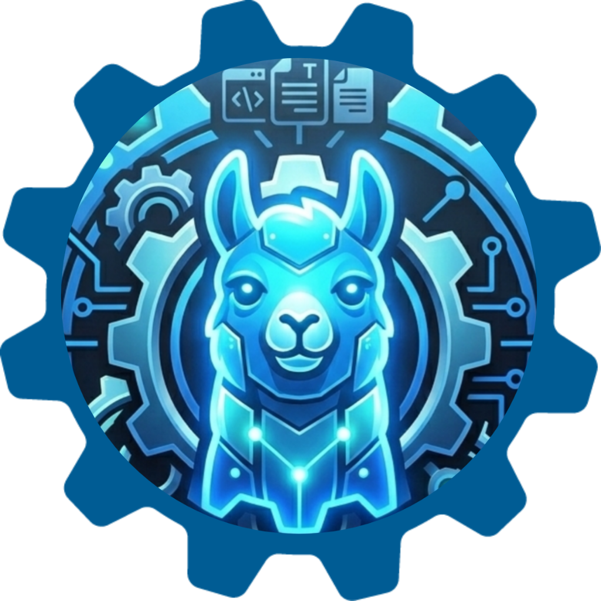

# ollama-forge

<p align="center">
  
</p>

<p align="center">
  <strong>Local AI Toolkit for Linux — 100% Offline, 100% Private</strong><br/>
  Ollama lifecycle management · PyQt6 desktop chat with RAG · AI-powered DevOps assistant
</p>

<p align="center">
  <a href="#quick-start">Quick Start</a> ·
  <a href="#ollama-main">ollama-main</a> ·
  <a href="#ollama-gui">Ollama GUI</a> ·
  <a href="#dev-assist">dev-assist</a> ·
  <a href="#architecture">Architecture</a> ·
  <a href="#development">Development</a>
</p>

---

## Overview

**ollama-forge** is a privacy-first, offline-first suite of three tightly integrated tools for running, managing, and working with local AI models on Linux. With **Ollama local inference** (the default everywhere) all compute stays on your machine — no telemetry, no data leaving your network. Optional cloud providers (OpenAI, Anthropic, Groq, OpenRouter, Mistral, Azure, custom endpoints) can be switched in at runtime when you want them.

The suite ships as standalone **PyInstaller single-file binaries** with no Python runtime or virtual environment required at deployment time.

| Component | Binary | Role |
|-----------|--------|------|
| [**ollama-main**](#ollama-main) | `ollama-main` | CLI lifecycle manager for the Ollama binary — install, upgrade, update-check, uninstall |
| [**Ollama GUI**](#ollama-gui) | `Ollama-ai-gui` | Full-featured PyQt6 desktop chat with 8 AI providers (Ollama, OpenAI, Anthropic, Groq, OpenRouter, Mistral, Azure, custom), FAISS RAG, vision models, file/ZIP attachments, markdown rendering, notes panel, persistent long-term memory, and crew multi-agent mode |
| [**dev-assist**](#dev-assist) | `da` | AI-powered DevOps assistant — terminal REPL + FastAPI web UI with semantic code RAG, an OpenCode-style agent that reads/edits files and runs commands on its own (plain chat triggers it automatically), shell execution, git helpers, tunnel management, and multi-provider AI |

Part of the [dev-boffin-io](https://github.com/dev-boffin-io) **Forge Suite** — privacy-first developer tooling for Linux.

---

## Requirements

- **OS:** Linux (Debian/Ubuntu primary; ARM64 and proot-Termux fully supported)
- **Python:** 3.10 or later (build time only — not required at runtime)
- **Ollama:** Must be installed and running for the GUI and dev-assist (`ollama serve`)
- **sudo:** Required for system dependency installation and CLI symlinks in `/usr/local/bin`

---

## Quick Start

```bash
# 1. Clone
git clone https://github.com/dev-boffin-io/ollama-forge.git
cd ollama-forge

# 2. Install system dependencies (GUI build only; needs sudo for apt/dnf/etc.)
sudo bash builder/install-deps-gui.sh

# 3. Build everything
make all

# 4. Install CLI symlinks + desktop entry
make install

# 5. Verify
ollama-main --help
da --help
```

After `make install`, **Ollama Forge** appears in your application menu and `ollama-main` / `da` are available as system-wide commands.

---

## ollama-main

`ollama-main` is a lightweight CLI tool that manages the Ollama binary lifecycle on any Linux system. It wraps the official [Ollama install script](https://ollama.com/install.sh) and adds version-aware upgrade logic with dual GitHub API endpoints for reliability.

### Commands

```bash
ollama-main install     # Install Ollama if not present
ollama-main upgrade     # Upgrade to the latest GitHub release
ollama-main update      # Check version status without installing
ollama-main uninstall   # Stop service, disable systemd unit, remove all paths
```

### How it works

**Version detection** queries the GitHub Releases API (`/repos/ollama/ollama/releases/latest`) with an automatic fallback to the list endpoint when rate limits apply. Versions are parsed with a regex that handles pre-release suffixes (`0.6.0-rc1`, `0.6.0-beta`) and compared using [`packaging.version`](https://packaging.pypa.io/) for correct semantic ordering.

**Uninstall** is comprehensive: it stops and disables the systemd service if active, removes all paths written by the official install script (`/usr/local/bin/ollama`, `/usr/local/lib/ollama`, `/usr/share/ollama`, `/etc/systemd/system/ollama.service*`), reloads the systemd daemon, and auto-detects whether `sudo` is needed based on the running UID.

### Dependencies

| Package | Role |
|---------|------|
| `requests >= 2.28` | GitHub API queries |
| `packaging >= 23.0` | Semantic version comparison |

---

## Ollama GUI

`Ollama-ai-gui` is a full-featured desktop chat application built with **PyQt6**. It talks to a locally running Ollama server via its REST API or to any of eight cloud/local AI providers, stores all conversation history in a local SQLite database, and provides a FAISS-backed RAG system for document-grounded answers — all without LangChain.

### Provider Selector — 8 AI Providers

A provider combo box in the toolbar switches the backend at runtime between **Ollama** (local) and seven remote providers: **OpenAI, Anthropic, Groq, OpenRouter, Mistral, Azure OpenAI, and any custom OpenAI-compatible endpoint**:

- **Ollama (default):** All requests go to a locally running `ollama serve` instance. The server status button, Ollama Manager, and all model management features are active.
- **Remote providers:** Requests are routed via `providers.py` — an OpenAI-compatible `/chat/completions` client for OpenAI/Groq/OpenRouter/Mistral/Azure/custom, and the Anthropic Messages API for Anthropic. A **🔑 API key row** appears when the active provider requires one: keys are read from that provider's environment variable (`GROQ_API_KEY`, `OPENAI_API_KEY`, `ANTHROPIC_API_KEY`, …) or an explicit field, and persist to `~/.ollama_gui/settings.json` (clearable via the 🗑 Clear button). Ollama-specific controls, the server button, and the Ollama Manager are hidden/dimmed in remote-provider mode.

Switching providers is instant and non-destructive — conversation history and RAG state are preserved. Vision and embedding capabilities are auto-detected per provider (see [Vision Models](#vision-models)).

### Persistent Memory

The **💬 Session / 🧠 Persistent** button toggles long-term memory. In session mode each chat starts fresh; in persistent mode the GUI injects user-remembered facts (stored in the SQLite `memories` table, upserted by key) as a system-prompt prefix on every message, so the assistant keeps context across conversations. The toggle state persists across restarts.

### Hamburger Menu (☰)

The `☰` button opens a slide-out drawer panel containing:

- **Knowledge (RAG)** — attach files and folders for document-grounded answers.
- **Crews** — create and manage multi-agent pipelines.
- **📝 Notes** — personal note panel: create, edit, search, and send notes into the chat as a message (`notes_dialog.py`).
- **🧠 Long-term Memory** — browse and delete saved memory facts (persistent mode).
- **Ollama Manager** — launch the Ollama Manager window *(visible only in Ollama mode; hidden in remote-provider mode; disabled/dimmed when the server is OFF)*.

### Chat Navigation Popup

The conversation title button in the top bar opens a **popup chat list** (`Qt.Popup` frame) positioned directly below it. The popup contains a live-search field and the full conversation list — clicking any entry switches instantly without navigating away from the chat view.

### Theme

A **Dark / Light theme toggle** (🌙 / ☀️) button switches the entire UI stylesheet at runtime. The selected theme is persisted to `~/.ollama_gui/settings.json` alongside the active provider, its API key, the last-used model, and the persistent-memory toggle — all restored automatically on next launch.

### Chat Rendering — `chat_renderer.py`

AI responses are rendered as **styled HTML** in a `QTextBrowser` widget via `chat_renderer.py`, which converts markdown to HTML without any JS dependency:

- Headers (`#` → `######`), bold/italic/strikethrough, inline code
- Fenced code blocks with a language label and a **📋 Copy** button (JS-free `copy:N` anchor scheme with direct clipboard integration)
- Tables, bullet and numbered lists, blockquotes, horizontal rules
- Theme-aware background and border colours

### Attachments — `attachment_handler.py`

The 📎 attach button accepts any file type and processes it into model-ready content:

| Input | Behaviour |
|-------|-----------|
| **Images** (PNG, JPG, WEBP, …) | Base64-encoded and sent as vision content parts |
| **Code / text files** | Injected as fenced code blocks (60 KB cap per file) |
| **ZIP archives** | Treated as a **project session** — the full file tree is shown to the model every message; individual files are extracted on demand and injected as context |

Up to 30 files are processed per ZIP. The active ZIP session persists across multiple messages until cleared.

### Vision Models

When images are attached, `SmartChatWorker` auto-selects a vision-capable model for the active provider:

- **Ollama mode:** Detects vision models from the live Ollama model list (via `/api/show` capabilities) with keyword fallbacks (`llava`, `vision`, `moondream`, `phi3-v`, `minicpm-v`). Falls back gracefully with a warning if no vision model is available.
- **Remote providers:** Vision-capable models are identified and selected automatically. Providers whose models are all vision-capable (`vision_all`) accept images directly; others use per-model keyword hints. Remote images are sent in OpenAI-compatible `image_url` content parts (translated to `image` blocks by the Anthropic adapter), while Ollama uses the native `images` field.

### Code Execution — `code_runner.py`

AI-generated fenced code blocks can be **executed in a subprocess** via `CodeRunWorker`. Supported languages: Python, JavaScript/Node, Bash/Shell, Zsh, Ruby, TypeScript, C, C++, Go, Rust, Java, PHP, Perl, Lua, R. Each execution runs in a temp file with a **15-second timeout**. Output streams back to the chat via `pyqtSignal`.

### Architecture

The GUI is split into focused modules, each with a single responsibility:

```
gui/
├── main.py                 Main window — layout, provider selector, theme, chat popup
├── providers.py            Multi-provider catalog + REST clients (mirrors dev-assist/core/providers.py)
├── ollama_client.py        Ollama REST API client (streaming chat, model list, embed)
├── groq_client.py          Groq API client — streaming chat, model list, vision detection
├── chat_renderer.py        Markdown → styled HTML renderer for QTextBrowser
├── attachment_handler.py   Universal file processor — images, code, zip project context
├── code_runner.py          Fenced code block executor (15+ languages, subprocess)
├── database.py             SQLite store — conversations, messages, crews, memories, notes
├── rag_engine.py           FAISS RAG — document loading, chunking, embedding, search
├── workers.py              QThread workers — DirectChat, CrewChat, RAGBuild,
│                           GroqChatWorker, SmartChatWorker, CodeRunWorker
├── crew_dialogs.py         Crew configuration dialog + built-in templates
├── notes_dialog.py         Notes panel — create, edit, search, send to chat
├── manager_entry.py        Ollama-ai-manager binary entry point
├── ollama_manager/         Ollama Manager window — helpers, window, workers
├── _syspath_patch.py       PyInstaller frozen binary sys.path fix
└── requirements.txt
```

All blocking operations — AI inference, document indexing, service polling — run in **QThread workers** and communicate back to the main thread exclusively through `pyqtSignal`. The UI never blocks.

### Chat and Conversation Management

The left panel provides a full conversation sidebar:

- **New Chat** creates a fresh conversation in SQLite with auto-generated titles.
- **Search** filters conversations in real time as you type, without a database round-trip.
- **Right-click context menu** on any conversation offers rename, pin/unpin, and delete. Pinned conversations always sort to the top.
- The chat area streams tokens from the model as they arrive, flushed to the UI at a **120 ms interval** to balance smoothness against syscall overhead.
- **Stop generation** is available at any point via a mutex-protected `is_running()` flag in the worker thread — checked between every token flush.

Conversation history is preserved across restarts. The full message list for the active conversation is sent to Ollama with every request, enabling genuine multi-turn context.

### RAG (Retrieval-Augmented Generation)

The RAG system is a from-scratch implementation using **FAISS** and **sentence-transformers** — no LangChain, no ChromaDB, no external vector database service.

#### Indexing pipeline

**1. File loading** — supports PDF (`pypdf`), DOCX (`python-docx`), and plain text/code (UTF-8 with error replacement). All loaders are lazy-imported; missing dependencies produce a clear install instruction rather than a cryptic traceback.

**2. Chunking** — word-based sliding window (500 words, 80-word overlap) producing semantically coherent passages while preserving cross-boundary context.

**3. Deduplication** — each file is MD5-hashed before processing. Files already present in the index are skipped instantly, making incremental re-indexing fast regardless of project size.

**4. Embedding** — two backends, selected automatically by model name:
  - **Ollama models** (names containing `:`, e.g. `nomic-embed-text:latest`) — calls `/api/embed` (Ollama ≥ 0.3 batch endpoint) with automatic fallback to the legacy `/api/embeddings` one-by-one endpoint. Batch size is set to 1 to keep cancellation instant.
  - **HuggingFace sentence-transformers** (e.g. `all-MiniLM-L6-v2`) — local inference with a module-level model cache to avoid reloading on repeated queries. Batch size 32 for throughput.
  - All embedding vectors are **L2-normalised** before storage so that inner-product similarity equals cosine similarity without a separate normalisation step at query time.

**5. Storage** — `faiss.IndexFlatIP` (inner product / cosine) persisted to `~/.ollama_gui/rag/` as `index.faiss` + `meta.json`. Metadata stores chunk text, source filename, and file hash for per-document removal.

**6. Cancellation** — a `stop_cb` callable is polled between batches; indexing halts cleanly mid-way without corrupting the persisted index.

#### Search

At query time, the query string is embedded with the same model used during indexing and a top-k inner-product search is run against the FAISS index. Retrieved chunk texts are injected into the Ollama prompt as numbered context sections with source filenames.

#### Per-document removal

FAISS flat indices do not support element deletion. When a document is removed, the engine rebuilds the entire index from the remaining chunks — re-embedding all of them fresh. This is a deliberate trade-off: operational simplicity over update performance. For typical RAG workloads (tens to low hundreds of documents) the rebuild completes in seconds.

#### Embedding model selector

The embed model combo box is populated with installed Ollama models filtered to embedding-capable ones, with `nomic-embed-text:latest` and `mxbai-embed-large:latest` as named fallbacks when no embed models are detected. The selected model is stored per-index; switching models after indexing requires re-indexing (the GUI warns about this with a dialog).

### Crew Mode — Multi-Agent Pipelines

Crew mode runs a **sequential multi-agent pipeline** where each agent is a separately configured model and system prompt, and the output of each agent becomes the input (`{previous}`) for the next.

#### Built-in templates

| Template | Agents |
|----------|--------|
| **Research Crew** | Researcher → Analyst → Report Writer |
| **Coding Crew** | Architect → Coder → Reviewer |
| **Writing Crew** | Outliner → Drafter → Editor |

Templates are starting points. Every field is fully editable: agent role name, model (dropdown from the live Ollama model list), system prompt, and the `input_prompt` template.

#### Execution

`CrewChatWorker` runs in a QThread. It iterates the agent list sequentially, calling `OllamaClient.chat_stream` for each, and emits streamed tokens to the UI labelled with the agent name and model in the format `**[N. Role — model]**`. The first agent also receives the last 6 user turns from the current conversation as prior context. The full pipeline output is assembled as a single structured markdown document (`# CREW REPORT`) and saved to the conversation history in SQLite.

#### Custom crews

The `CrewConfigDialog` presents a scrollable list of agent cards. Each card exposes model selector, role name, system prompt, and input prompt template fields. Crews are persisted in the `crews` SQLite table. One crew can be marked as the default, applied automatically to new conversations.

### Ollama Manager

`Ollama-ai-manager` is a standalone window for the operational side of Ollama. All blocking work runs in daemon threads or `QThread` workers with `pyqtSignal` for thread-safe UI updates. The auth, server state, and install state panels are fully independent and do not block each other.

**Service control:** Start/stop the `ollama serve` process directly from the UI, with real-time stdout/stderr streaming to an output panel via a `_SubprocWorker` that pipes process output line-by-line. A `QTimer` polls `GET /api/tags` every few seconds and updates a status indicator LED.

**Model management:** Lists all installed models with size and quantisation metadata. Pull new models by name with a live progress bar (parses percentage suffixes from streaming output via regex). Delete models with a confirmation dialog. The model list auto-refreshes after pull/delete operations complete.

**Binary management:** Detects the installed Ollama version via `ollama --version`, fetches the latest release tag from the GitHub API, and can trigger an in-place upgrade via the same official install script used by `ollama-main`.

- Before any privileged operation (install / upgrade / uninstall), a **sudo password dialog** prompts the user. Root users bypass it automatically.
- The entire `install.sh` runs as root via `sudo -kS sh -c "curl -fsSL https://ollama.com/install.sh | sh"` — password passed once via stdin so all internal `sudo` calls inside the script inherit root context without re-prompting.
- The Ollama Manager button is disabled (dimmed) when the server is OFF, and hidden entirely in remote-provider mode.

**Authentication:** Reads `~/.ollama/config` and `~/.config/ollama/config` to detect a logged-in username. Supports login and logout via `ollama login` / `ollama logout` subprocess calls with credential entry fields in the UI.

### Window and Theme

- Default window size **1800 × 900**
- Base font sizes **32 px UI / 44 px chat / 40 px input** — optimised for high-DPI displays and accessibility
- **Dark / Light theme toggle** — switches the entire Qt stylesheet at runtime; preference persisted to `~/.ollama_gui/settings.json`
- Full-width chat layout — no fixed left panel; conversation list accessed via the title popup button
- All interactive controls have `setMinimumHeight(60–64 px)` for comfortable use with trackpads and touch
- `QTextBrowser` used for chat display (HTML rendering); `QTextEdit` retained for input only — preserves non-Latin (Bengali, Arabic, etc.) input rendering

### Dependencies

| Package | Role |
|---------|------|
| `PyQt6 >= 6.6` | GUI framework |
| `requests >= 2.28` | Ollama REST API, remote provider APIs, GitHub version check |
| `sentence-transformers >= 2.6` | Optional embedding backend (falls back to hashed TF-IDF when unavailable) |
| `faiss-cpu >= 1.7` | Vector index for RAG |
| `pypdf >= 3.0` | PDF document loading |
| `python-docx >= 1.0` | DOCX document loading |

> **Remote providers** (OpenAI, Anthropic, Groq, OpenRouter, Mistral, Azure, custom) require no additional packages — `providers.py` uses `requests` directly. Get a free key at [console.groq.com](https://console.groq.com), [platform.openai.com](https://platform.openai.com), or your provider of choice.

---

## dev-assist

`dev-assist` is a personal AI DevOps assistant designed for developer and sysadmin workflows. It runs as a **terminal REPL** with `rich` formatting and `prompt-toolkit` readline, or as a **FastAPI web UI** (plain HTML/JS frontend) with full async streaming — served in-process via uvicorn, so it packages into a single onefile binary with no external Python or Node.js dependency. It combines local AI inference, semantic code RAG, live shell execution, and specialised task modules in a single unified interface.

### Usage

```bash
# Terminal REPL
da

# FastAPI web UI
da --web
da --web --port 8080

# Shell passthrough inside the REPL
⚡ dev-assist > ~$ !ls -la
⚡ dev-assist > ~$ !git log --oneline -10
⚡ dev-assist > ~$ !docker ps -a
⚡ dev-assist > ~$ !htop

# Chat — OpenCode-style: any message runs the default agent (tools + planning)
⚡ dev-assist > ~$ what files are in this project?  # agent lists them on its own
⚡ dev-assist > ~$ fix the failing test in tests/
⚡ dev-assist > ~$ add rate limiting to the API client

# Agent mode (explicit — same loop, flag-selectable)
⚡ dev-assist > ~$ do refactor core/session.py --agent coder  # force an agent
⚡ dev-assist > ~$ do refactor core/session.py --verbose      # show full tool output
⚡ dev-assist > ~$ do cleanup build artifacts --yes           # auto-approve prompts
⚡ dev-assist > ~$ do bump the version everywhere --auto      # no approval prompts
⚡ dev-assist > ~$ undo                                       # revert the last run's changes

# Headless run (CI-friendly, no REPL)
da run "fix the failing test"                # one-shot agent run, plain output
da run "bump version" --output json         # NDJSON events, exit 0 only if it delivered
da run "refactor" --agent coder --auto      # force an agent / no approval prompts
echo "fix the lint errors" | da run         # pipe the task on stdin

# Project instructions & permissions (opencode-style)
⚡ dev-assist > ~$ /init                     # write AGENTS.md — auto-loaded into every prompt
⚡ dev-assist > ~$ /themes                  # pick a TUI color theme (default/ocean/gruvbox/…)
# custom command files: <project>/.dev-assist/commands/*.md  (or ~/.config/dev-assist/commands/)

# Indexing and fast RAG (explicit `ask`)
⚡ dev-assist > ~$ index .                    # Index current project
⚡ dev-assist > ~$ index /path/to/project     # Index a specific path
⚡ dev-assist > ~$ index status               # Show indexing stats
⚡ dev-assist > ~$ index clear                # Clear the index
⚡ dev-assist > ~$ ask what does the router do?   # RAG over the index (no tools)

# DevOps modules
⚡ dev-assist > ~$ audit                      # AI code audit on staged diff
⚡ dev-assist > ~$ git push                   # AI-assisted git push with error explanation
⚡ dev-assist > ~$ git conflict               # Show conflicts and AI resolution advice
⚡ dev-assist > ~$ fix port 8080              # Find and kill process on port 8080
⚡ dev-assist > ~$ tunnel                     # cloudflared tunnel management
⚡ dev-assist > ~$ expose 3000                # Quick-expose port 3000 via tunnel

# Slash commands & persistent sessions
⚡ dev-assist > ~$ /model                     # interactive model picker
⚡ dev-assist > ~$ /provider                  # switch provider interactively
⚡ dev-assist > ~$ /themes · /theme 2        # theme picker / switch directly
⚡ dev-assist > ~$ /new · /sessions · /resume # persistent sessions (/compact, /rename, /delete)
⚡ dev-assist > ~$ /init · /review · /agents  # guided agents.md setup, code review, agent info
⚡ dev-assist > ~$ /help                      # list all slash commands

# Built-ins
⚡ dev-assist > ~$ status                     # AI engine, model, session info
⚡ dev-assist > ~$ history                    # Show conversation history
⚡ dev-assist > ~$ history clear              # Clear conversation history
⚡ dev-assist > ~$ model                      # Switch AI model interactively
⚡ dev-assist > ~$ help                       # Full command reference
```

### Architecture

```
dev-assist/
├── main.py                 CLI entry point — argument parsing, REPL loop, TUI toolbar
├── web_app.py              FastAPI web UI — async streaming handlers
├── webui/                  Plain HTML/CSS/JS frontend (no build step)
├── core/
│   ├── ai.py               AI engine — provider-agnostic front-end over core.providers
│   ├── agents.py           Agent registry + automatic routing and compaction
│   ├── providers.py        Multi-provider catalog — Ollama, OpenAI, Anthropic, Groq,
│   │                       OpenRouter, Mistral, Azure, custom (mirrors gui/providers.py)
│   ├── agent.py            Tool-calling agent loop — planning, sub-tasks, approval
│   ├── tools.py            JSON-Schema tool registry + execution (read/edit/bash/tests/search)
│   ├── mcp.py              MCP stdio client — model-context-protocol tool servers
│   ├── lsp.py              LSP client — Content-Length framed language-server diagnostics
│   ├── permissions.py      Allow/ask/deny permission rules for tool calls
│   ├── instructions.py     AGENTS.md auto-discovery + preload into prompts
│   ├── theme.py            TUI color themes (default/ocean/gruvbox/monokai/nord)
│   ├── repo_map.py         Compact project map — file tree + top-level signatures
│   ├── change_tracker.py   Snapshot + undo for agent-made file edits
│   ├── tui_status.py       Persistent bottom-toolbar state (activity + Ollama status)
│   ├── config.py           Pydantic-validated config with env var overrides
│   ├── prompts.py          Jinja2 prompt template engine with built-in fallback
│   ├── rag_engine.py       RAG orchestrator — retrieval, re-ranking, prompt build
│   ├── router.py           Intent detection — regex dispatch to modules / agent fallback
│   ├── session.py          In-memory conversation context — history, cwd, model
│   ├── session_store.py    Persistent sessions (SQLite) with write-through recording
│   ├── shell.py            Subprocess helpers — run_git, RunResult
│   ├── vector_store.py     SQLite embedding store (Ollama /api/embed + TF-IDF fallback)
│   ├── cli_history.py      Persistent CLI history saved to the data directory
│   ├── attachment_handler.py  Image/text upload processor for the web UI
│   ├── ollama_status.py    Ollama health check and model list helpers
│   └── banner.py           Rich-formatted startup banner
├── modules/
│   ├── agent_mode.py       Agent CLI front-end — plan panels, diff previews, undo
│   ├── slash_commands.py   /commands — provider/model pickers, sessions, /theme, command files
│   ├── shell_exec.py       Interactive shell passthrough with session cwd tracking
│   ├── git_helper.py       AI-assisted git conflict/push/pull/rebase helpers
│   ├── code_audit.py       Staged diff audit via AI review prompt
│   ├── file_tool.py        File rename, bulk clean utilities
│   ├── indexer.py          Project tree scanner and semantic chunker
│   ├── tunnel_helper.py    cloudflared tunnel start/stop/status
│   └── cmd_helper.py       Port conflict detection and fix
├── plugins/
│   ├── makefile.py         Makefile target runner plugin
│   └── telegram.py         Telegram bot integration plugin
├── config/
│   └── settings.json       Persistent config (active provider, models, preferences)
├── data/index.db           SQLite embedding store for project-code RAG
└── tests/
    ├── test_agent.py        Agent loop, planning, approval, tool dispatch
    ├── test_agent_mode.py   agent-mode flag parsing and undo flow
    ├── test_main_shortcuts.py  Ctrl+P palette / leader-key shortcuts
    ├── test_providers.py    Provider catalog, key resolution, adapters
    ├── test_rag.py          RAG engine and vector store tests
    ├── test_repo_map.py     Repo-map building and similarity fallback
    ├── test_router.py       Intent routing, agent fallback, explicit `ask`
    ├── test_session_store.py  SQLite session persistence and /resume
    ├── test_shell.py        Shell execution tests
    ├── test_slash_commands.py  /provider + /model pickers
    └── test_tools.py        Tool registry, execution, root confinement
```

### AI Engine

The AI engine (`core/ai.py`) is a provider-agnostic front-end over **`core/providers.py`**, an eight-provider catalog: **Ollama, OpenAI, Anthropic, Groq, OpenRouter, Mistral, Azure OpenAI, and custom OpenAI-compatible endpoints**. All providers share the same interface (`list_models()`, `validate()`, `chat()`, `stream()`), so sync CLI, async web streaming, RAG, and agent mode work identically regardless of backend. The active provider and model are switched at runtime from the REPL (`model provider <id>`, `model set <name>`, `model list`).

Providers are grouped into **three transport dialects**, hidden behind the adapters:

- **`ollama`** — the local Ollama server via the python `ollama` client (`http://localhost:11434`).
- **`openai_compat`** — OpenAI-style `/chat/completions` REST for OpenAI, Groq, OpenRouter, Mistral, Azure OpenAI, and any OpenAI-compatible local server (vLLM, LM Studio, Ollama's OpenAI layer, …).
- **`anthropic`** — the Anthropic Messages API (`tool_use`/`tool_result` blocks are converted to the same normalized message shape as the other dialects).

**API keys are never required up front.** They are resolved lazily from environment variables at request time (`GROQ_API_KEY`, `OPENAI_API_KEY`, `ANTHROPIC_API_KEY`, … or the catch-all `DEV_ASSIST_API_KEY`) and are never written to `settings.json`.

```json
{
  "active_provider": "ollama",
  "providers": {
    "ollama":  { "default_model": "qwen2.5-coder:7b" },
    "groq":    { "default_model": "llama3-70b-8192" },
    "openai":  { "default_model": "gpt-4o-mini" }
  }
}
```

**Multi-turn conversation:** when session history exists, the engine sends the full history as messages through the active provider's `stream()` (or `chat()`), giving the model genuine multi-turn context. The `capture_output=True` flag on `ask_ai()` also collects and returns the full response string for use by modules that need the output programmatically (e.g. git helper, code audit).

**Streaming — CLI:** `ask_ai()` prints tokens to stdout as they arrive using the provider's synchronous streaming generator.

**Streaming — web UI:** `ask_ai_streaming()` is an async generator that bridges the synchronous provider stream into FastAPI's async event loop without blocking it, streamed to the browser over Server-Sent Events.

### Pydantic Configuration

`core/config.py` uses **Pydantic v2** for validated, type-safe configuration with a three-level priority chain:

```
Environment variables  (DEV_ASSIST_API_KEY, etc.)
       ↓  highest priority
config/settings.json
       ↓
Pydantic field defaults
```

The `ApiEngineConfig` and top-level `AppConfig` models validate all fields on load and raise structured `ValidationError` with field-level messages rather than silent misconfigurations. Sensitive fields (`api_key`) are excluded from JSON serialisation and read-only from environment variables.

Beyond the AI engine settings, `config/settings.json` carries the agent-mode options that previously required REPL flags:

```json
{
  "theme": "ocean",
  "autocommit": "off",
  "permissions": {
    "bash": {"allow": ["git log*", "git status*"], "deny": ["git reset*"]},
    "edit": "ask"
  },
  "mcp_servers": {
    "fs": {"command": "npx", "args": ["-y", "@modelcontextprotocol/server-filesystem", "/tmp"]}
  },
  "lsp": {"python": {"command": "pylsp", "args": []}}
}
```

- `theme` — active TUI theme (`/themes` to pick, `default/ocean/gruvbox/monokai/nord`).
- `autocommit` — `off` / `ask` / `auto`: commit agent changes automatically after a run.
- `permissions` — per-tool `allow` / `ask` / `deny` rules (see *Agent Mode*).
- `mcp_servers` — MCP stdio servers whose tools are exposed as `mcp__<server>__<tool>`.
- `lsp` — a Language Server per file extension (mapped by the edited file's suffix).

When Pydantic is not installed, the config module gracefully degrades to raw JSON loading with manual fallbacks, keeping the tool functional in minimal environments (e.g. proot-Termux without build tools).

Path resolution for the config file handles both normal dev usage (repo-relative `config/settings.json`) and PyInstaller frozen binary mode (via `DEV_ASSIST_CONFIG_DIR` environment variable injected by the runtime hook at startup).

### Agent Mode

`core/agent.py` implements a **tool-calling agent loop** with multi-step planning — the model acts on your project instead of just answering. Invoked from the `modules/agent_mode.py` CLI front-end via **`do <task>`**, **`agent <task>`**, **`undo`** — and, by default, through **any ordinary chat message** (OpenCode-style, no `do` prefix needed). Plain messages honor the same `--agent`, `--yes`, and `--verbose` flags. The agent always works inside the directory dev-assist was launched in: file tools reject any path that escapes the project root.

**Planning:** before doing anything, the agent asks the model to split the task into 2–5 concrete sub-tasks (a plan). Each sub-task runs its own tool loop with its own step budget (default 24 steps, with a hard 120-step safety cap across the whole run), carrying prior sub-task results forward as context. A final combined answer summarizes the whole run.

**Tools:** a JSON-Schema tool registry (`core/tools.py`) that works across every provider — Ollama native tool calling, OpenAI-compatible chat completions, and the Anthropic Messages API. Read-only tools (`read_file`, `list_dir`, `glob`, `grep`) run freely; destructive tools (`write_file`, `edit_file`, `bash`) are gated behind an approval callback. `run_tests` and `web_search` round out the registry:

| Tool | Purpose |
|------|---------|
| `read_file` / `list_dir` | Read files / list directories (line-numbered output) |
| `glob` / `grep` | Find files by pattern / search contents by regex |
| `write_file` / `edit_file` | Create/overwrite files / exact-string in-place edits |
| `bash` | Run shell commands (builds, tests, git) |
| `run_tests` | Auto-detect and run the test suite (pytest, unittest, npm test, go test, cargo test, make test) |
| `web_search` | Keyless DuckDuckGo HTML search (or a configured search API) |
| `lsp_diagnostics` | Live diagnostics for the edited file via a configured LSP server |
| `mcp__*` | One tool per tool exposed by your configured MCP servers |

MCP servers and an LSP server (per file extension) are configured in `config/settings.json` and registered dynamically at first use — `core/mcp.py` speaks MCP stdio (newline-delimited JSON-RPC) for any Model Context Protocol server, and `core/lsp.py` speaks the Content-Length framed protocol to surface diagnostics for the file the agent is editing.

**Repo map:** before planning, `core/repo_map.py` injects a compact project map — the file tree plus top-level function/class signatures (structure only, never full code) — into the agent's prompts. For large projects the map is narrowed by the vector store's similarity search to files relevant to the task, and re-narrowed per sub-task.

**Approval:** destructive tools are gated behind an approval callback. The REPL front-end shows **real unified diff previews** (computed against the actual file contents) and asks `approve? [y]es / [n]o / [a]lways` before running anything destructive. Declined calls feed the user's reason (if any) back to the model so it can adapt. Flags: `--yes` auto-approves prompts, `--auto`/`--yolo` skips approval entirely while still tracking changes for undo, `--verbose` shows full tool output.

**Project instructions (AGENTS.md):** `core/instructions.py` discovers every `AGENTS.md` from the project root down to the working directory, reads them, and preloads their rules into the agent's system prompt (deepest file last, so the most specific rules win). `/init` scaffolds a starter `AGENTS.md`. With `"autocommit"` enabled in settings, a finished agent run that touched files commits them automatically and reports the commit hash.

**Permissions:** approval rules can be expressed declaratively in `config/settings.json` via `core/permissions.py` — `allow`, `ask`, and `deny` globs over tool names (e.g. deny `git reset*`). A matching `allow` auto-approves, a matching `ask` prompts, and a matching `deny` rejects the call; unmatched destructive calls still prompt. Since `permissions` takes precedence over an `--auto` flag, deny rules bind even in yolo mode.

**Change tracking & undo:** every `write_file`/`edit_file` in a run is snapshotted before it happens (`core/change_tracker.py`). When the run finishes you get a diffstat (`+N -M files changed`) and can type **`undo`** to revert every touched file — including deleting files the agent created. Trackers are kept across calls in one REPL session, and the activity line is mirrored into the persistent bottom toolbar (`core/tui_status.py`) so you always see live agent activity even while the REPL is idle.

### Semantic Code RAG

The RAG system in dev-assist is purpose-built for codebases, with semantic chunking, hybrid retrieval, and conversation-aware query enrichment.

#### Semantic chunking

`modules/indexer.py` scans the project tree and splits files at **semantic boundaries** — function and class definitions — rather than fixed line counts. Language-specific boundary patterns are compiled regexes:

| Language | Boundary patterns |
|----------|-------------------|
| Python | `def `, `class `, `async def ` |
| Go | `func `, `type X struct`, `type X interface` |
| JavaScript/TypeScript | `function `, `class `, `export default function`, `const x = (` |
| Rust | `pub fn `, `fn `, `impl `, `struct `, `enum `, `trait ` |
| Java/Kotlin | `public `, `private `, `protected `, `class ` |
| Others | Fixed window (50 lines, 8-line overlap) |

Each chunk carries `filepath`, `start_line`, `end_line`, and the file's `mtime` timestamp for change detection on re-index.

**Incremental re-indexing:** Files are only re-processed when their `mtime` has changed since the last index run. Running `index .` on an unchanged project completes near-instantly regardless of size.

**Skipped paths:** `__pycache__`, `node_modules`, `.venv`, `.git`, `dist`, `build`, `.pytest_cache`, `target` (Rust), `.ruff_cache`, `.mypy_cache`, and other build artefact directories are excluded automatically. Files larger than 500 KB are also skipped.

**Supported extensions:** 35+ types including `.py`, `.js`, `.ts`, `.jsx`, `.tsx`, `.go`, `.rs`, `.c`, `.cpp`, `.h`, `.java`, `.kt`, `.rb`, `.php`, `.swift`, `.sh`, `.bash`, `.zsh`, `.md`, `.txt`, `.rst`, `.json`, `.yaml`, `.toml`, `.html`, `.css`, `.sql`.

#### Vector store with hybrid scoring

`core/vector_store.py` implements **hybrid retrieval** combining TF-IDF sparse scoring and dense embedding vectors:

- Dense vectors use real semantic embeddings from Ollama's `/api/embed` (`nomic-embed-text`) when available, with a pure-Python TF-IDF cosine fallback when they aren't — no external vector database, fully offline.
- Hybrid scores are a weighted combination of cosine similarity (dense) and TF-IDF overlap (sparse), improving recall across both semantic and exact-keyword queries.
- The store persists to a **SQLite database** (`dev-assist/data/index.db`, WAL mode) holding embeddings plus filepath, start/end line, content, and `mtime` metadata — enabling incremental re-indexing and per-project retrieval.

#### Conversation-aware query enrichment

Before executing the vector-store search, `core/rag_engine.py` enriches the user query with identifiers extracted from the most recent assistant response — backtick-delimited names like function names, class names, and error codes. This means follow-up questions like "what does that function do?" retrieve the right chunks even when the query itself lacks explicit names.

```python
# Example enrichment
query = "what does that function do?"
last_assistant_mentions = ["SessionContext", "add_user", "trim"]
effective_query = "what does that function do? SessionContext add_user trim"
```

### Jinja2 Prompt Templates

`core/prompts.py` provides a named template system backed by **Jinja2** with a pure-Python fallback renderer for environments without Jinja2 installed. The `render(template_name, **kwargs)` API is consistent regardless of which path is taken.

External templates are loaded from `prompts/*.j2` files at runtime; the five built-in templates below are always available as embedded fallbacks.

| Template | Variables | Use case |
|----------|-----------|----------|
| `rag_ask` | `query`, `chunks[]` (filepath, start_line, end_line, content) | Codebase Q&A with retrieved context sections |
| `code_audit` | `diff` | Staged git diff review for bugs, security issues, style |
| `git_fix` | `error_output`, `branch`, `remote`, `operation` | AI-explained git error recovery with exact fix commands |
| `error_explain` | `error_text`, `context` | Plain-language error explanation with fix steps |
| `shell_explain` | `command`, `output` | Shell command and output explanation |

The `rag_ask` template instructs the model to answer **only from the provided code context**, reference exact file and function names, explain bugs clearly with fix suggestions, and format code with markdown fences. This produces precise, grounded answers rather than hallucinated generalisations about the codebase.

The fallback renderer handles ``, ``, `{{ var }}`, and `{{ var|default('...') }}` via regex substitution — enough to render all five built-in templates correctly without Jinja2.

### Intent Router

`core/router.py` matches every REPL input against an ordered list of **regex intent patterns** and dispatches to the corresponding module function. There is no NLP classifier — the regex approach is fast, completely predictable, and trivially debuggable.

Intent categories in match-priority order:

| Priority | Intent | Matched input examples |
|----------|--------|------------------------|
| 1 | Agent mode | `do fix the failing test`, `agent add a CLI flag`, `undo` |
| 2 | Ollama service control | `ollama on`, `ollama stop`, `ollama status` |
| 3 | Indexer | `index .`, `index status`, `idx /src` |
| 4 | Code audit | `audit`, `audit staged` |
| 5 | Port conflict | `fix port 8080`, `kill port 3000`, `port 5432` |
| 6 | Tunnel | `tunnel`, `expose 8000`, `ngrok` |
| 7 | Git | `git push`, `git conflict`, `git rebase fix` |
| 8 | File tools | `rename`, `clean` |
| 9 | Built-ins | `model`, `help`, `status`, `history`, `plugins` |
| 10 | Plugin check | Dynamic dispatch to registered plugins |
| 11 | RAG (explicit) | `ask <question>` — fast Q&A over the index, no tools |
| 12 | Agent fallback (default) | any unmatched input — runs the default `build` agent with tools + planning |

Inputs that match no pattern fall through to the default agent (OpenCode-style): the model gets the full toolset and plan-and-execute loop, and works inside the directory dev-assist was launched from (file tools reject any path that escapes the project root). For fast, tool-free Q&A over an indexed codebase use `ask <question>`. Shell passthrough (lines prefixed with `!` or `!run`) bypasses the router entirely and goes directly to `modules/shell_exec.py`.

### Shell Execution

`modules/shell_exec.py` runs commands interactively in the user's current terminal using `subprocess` with `shell=True`. Pipelines, redirects, environment expansion, and interactive programs (`vim`, `less`, `htop`, `docker exec -it`) all work correctly because stdin is inherited from the parent process.

**Working directory tracking:** A module-level `_session_cwd` variable tracks the current directory across the session. `cd <dir>` commands are intercepted before subprocess execution and update `_session_cwd` (with `cd -` support via `_prev_cwd`). All subsequent shell commands run in the tracked directory.

### Git Helper

`modules/git_helper.py` handles the most common git friction points:

- **Conflict resolution:** Displays conflicted files and untracked changes in a Rich table, then feeds the conflict output to the AI for a plain-language explanation and suggested resolution steps.
- **Push failures:** Captures stderr from `git push`, sends it to the `git_fix` Jinja2 template enriched with current branch, remote, and operation type, and streams an AI-generated fix plan with exact commands.
- **Pull / rebase errors:** Same pattern — capture error output, enrich with repo context, AI explains the root cause and provides a safe, non-destructive recovery sequence.
- **Status overview:** Rich-formatted view of `git status --short`, recent 5-commit log, and remote configuration.

### Code Audit

`modules/code_audit.py` runs `git diff --staged` to capture the current staged changes, then sends the diff to the `code_audit` Jinja2 template. The prompt instructs the model to review for:

- Bugs and logic errors
- Security vulnerabilities (SQL injection, XSS, hardcoded secrets, path traversal)
- Performance bottlenecks
- Code style and best-practice violations
- Missing error handling and edge cases

Each finding is formatted with a severity emoji: `🔴 CRITICAL`, `🟡 WARNING`, `🟢 INFO`, including the filename and a concise description. This makes the audit output scannable and actionable in a terminal.

### Session Context

`core/session.py` maintains an in-memory conversation history as a list of `Turn` dataclasses (`role`, `content`, `timestamp`). History is trimmed to the last **20 user+assistant turn pairs** and to a maximum of **8,000 characters** when building the context prompt, preventing context window overflow on smaller models.

The session provides:
- `to_ollama_messages()` — converts history to Ollama chat API format for multi-turn inference
- `build_history_prompt()` — injects recent history into the RAG prompt as a conversation context section, with reverse-order trimming to always include the most recent turns
- `indexed_path` — tracks the currently indexed project path so RAG queries target the right codebase implicitly
- `history_summary()` — formatted string showing turn count and session elapsed time, shown by `da> status`

When a session is active, its short id is shown directly in the REPL prompt and the persistent toolbar (`⚡ dev-assist [a1b2c3] > ~$`), so you can tell which thread you are in without running `/status`.

### Web UI (FastAPI)

`web_app.py` implements the web interface (`da --web`) with full async streaming over Server-Sent Events, served by `uvicorn` in the same process (no subprocess, no separate CLI tool). The frontend in `webui/` is plain HTML/CSS/JS with no build step, so it packages cleanly into a single onefile binary. Access is **open by default — no login or registration required**.

- All AI responses stream token-by-token using async generators from `core/ai.ask_ai_streaming`.
- RAG queries use `core/rag_engine.ask_with_context_async`, which yields tokens to the browser and saves the full response to session history on completion.
- File uploads (documents for RAG indexing) are accepted inline in the chat.
- Per-session chat history and model settings are maintained in-memory for the duration of the browser session.
- Ollama start/stop and status are available via action buttons or inline commands (`ollama on`, `ollama off`, `ollama status`).
The web UI exposes the identical functionality as the terminal REPL — the same router, modules, AI engine, and session management — accessed through a browser.

### Plugins

The plugin system allows extending dev-assist with additional task handlers registered dynamically as a fallback stage in the router (between built-ins and the agent fallback).

**Makefile plugin** (`plugins/makefile.py`): Detects `Makefile` targets in the project root and allows running them directly from the REPL by name.

**Telegram plugin** (`plugins/telegram.py`): Forwards assistant responses to a configured Telegram chat via Bot API — useful for receiving notifications from long-running tasks asynchronously.

### Test Suite

```
dev-assist/tests/
├── test_agent.py          Agent loop, planning, approval gating, tool dispatch, undo,
│                          AGENTS.md instruction injection
├── test_agent_mode.py     agent-mode flag parsing (--auto/--yes/--verbose) and undo flow
├── test_main_shortcuts.py REPL leader-key / Ctrl+P palette shortcuts
├── test_providers.py      Provider catalog, lazy key resolution, adapter normalisation
├── test_rag.py            Vector store operations, semantic chunking, hybrid retrieval,
│                          mtime-based change detection, conversation-aware query enrichment
├── test_repo_map.py       Repo-map building, signature extraction, similarity fallback
├── test_router.py         Intent pattern matching, module dispatch, agent fallback,
│                          explicit `ask` routing, plugin fallthrough
├── test_session_store.py  SQLite session persistence and /resume restore
├── test_shell.py          Shell execution, session cwd tracking, cd/cd- handling,
│                          pipeline and redirect support
├── test_slash_commands.py /provider + /model switching, interactive pickers,
│                          /theme + /themes, custom command markdown files
├── test_tools.py          Tool registry, JSON-Schema declarations, project-root
│                          confinement, destructive-tool gates
├── test_theme.py          Theme presets, switching, persistence, toolbar styles
├── test_permissions.py    Allow/ask/deny verdicts, wildcard/prefix matching
├── test_instructions.py   AGENTS.md discovery, caching, instruction injection
├── test_mcp.py            MCP stdio framing against a fake NDJSON server
├── test_lsp.py            LSP Content-Length framing + diagnostics against a fake server
├── test_dynamic_tools.py  register_tool, MCP/LSP schema injection into the registry
└── test_headless_run.py   `da run`: flag forwarding, JSON output, stdin task, exit codes
```

Run with:

```bash
make test
# or
cd dev-assist && python -m pytest tests/ -v --tb=short
```

### Environment Variables

| Variable | Default | Description |
|----------|---------|-------------|
| `DEV_ASSIST_API_KEY` | — | Catch-all API key for remote providers (Groq/OpenAI/…); provider-specific keys (`GROQ_API_KEY`, …) are also respected. Never stored in settings.json |
| `DEV_ASSIST_DATA_DIR` | `~/.config/dev-assist` | Persistent CLI history directory (SQLite `cli_history.db`) |
| `DEV_ASSIST_CONFIG_DIR` | Repo-relative `config/` | Settings file directory (auto-set in frozen binary by runtime hook) |

### Dependencies

| Package | Role |
|---------|------|
| `ollama` | Local AI inference SDK |
| `pydantic >= 2.0` | Config validation and type safety |
| `rich >= 13.0` | Terminal formatting — panels, tables, progress bars |
| `prompt-toolkit >= 3.0` | REPL readline, persistent history, completions |
| `jinja2 >= 3.1` | Prompt template rendering |
| `fastapi >= 0.110` | Web UI backend — async routes, SSE streaming |
| `uvicorn >= 0.29` | ASGI server that runs the web UI in-process |
| `python-multipart >= 0.0.9` | Multipart form parsing for file uploads |
| `Pillow >= 10.0` | Image attachment resize/compress before sending to vision models |

---

## Architecture

### Data Flow — GUI Chat with RAG

```
User types query (+ optional attachments)
       │
       ▼
OllamaGUI._send_message()
       │
       ├─ Attachments? ─images──► base64-encode via attachment_handler.py
       │               ─text/zip─► inject as fenced code blocks in user message
       │
       ├─ RAG enabled? ──yes──► RAGIndex.search(query, k=5)
       │                              │
       │                         FAISS IndexFlatIP.search()
       │                              │
       │                         inject top-k chunk texts into system prompt
       │
       ├─ Provider mode? ──► SmartChatWorker (QThread)
       │                              │
       │                    images? → auto-select vision model
       │                              │
       │                    get_client(provider_id, api_key).chat_stream()
       │                    (Ollama /api/chat · OpenAI-compatible REST ·
       │                     Anthropic Messages)
       │                              │
       │                    token → pyqtSignal [flushed every 120ms]
       │
       └─ Crew mode? ──────► CrewChatWorker (QThread)
                                      │
                             sequential agents via the same provider client
                                      │
                             streamed tokens → pyqtSignal
       │
       ▼
chat_renderer.chat_html() → QTextBrowser.setHtml()
       │
       ▼
SQLiteDB.save_message(conversation_id, role, content)
```

### Data Flow — dev-assist REPL

```
User input
    │
    ├─ starts with '!' ──────────────────► shell_exec.run_shell_command()
    │                                            │
    │                                      subprocess(shell=True, cwd=session_cwd)
    │
    ├─ router.handle_input(text)
    │       │
    │       ├─ do/agent/undo ────────────► modules.agent_mode.run()/undo()
    │       │                                   │
    │       │                             core.agent.run_agent()
    │       │                                   ├─ repo_map.build_repo_map()  (project map)
    │       │                                   ├─ plan sub-tasks (provider chat)
    │       │                                   ├─ per sub-task: tools.execute_tool(name, args)
    │       │                                   │       │
    │       │                                   │       ├─ write/edit → change_tracker.snapshot()
    │       │                                   │       │                (approver gate first)
    │       │                                   │       └─ result fed back to model
    │       │                                   └─ final answer (+ 'undo' revert)
    │       │
    │       ├─ ollama on/off/status ──────► ollama_status.{start,stop,check}()
    │       │
    │       ├─ index / idx ──────────────► indexer.run(text)
    │       │                                   │
    │       │                             semantic chunking + SQLite embed store
    │       │
    │       ├─ audit ────────────────────► code_audit.run()
    │       │                                   │
    │       │                             git diff --staged → prompts.render("code_audit")
    │       │
    │       ├─ git … ────────────────────► git_helper.run(text)
    │       │                                   │
    │       │                             run_git() → prompts.render("git_fix") → ai.ask_ai()
    │       │
    │       ├─ port / tunnel / rename ──► cmd_helper / tunnel_helper / file_tool
    │       │
    │       ├─ plugin match ────────────► plugin.handle(text)
    │       │
    │       ├─ ask <q> (explicit) ─────► rag_engine.ask_with_context(text)
    │       │                               │
    │       │                               ├─ session._enrich_query(text)
    │       │                               ├─ vector_store.search(enriched, top_k=6)
    │       │                               ├─ prompts.render("rag_ask", query, chunks)
    │       │                               └─ ai.ask_ai(prompt)  [stream to stdout]
    │       │
    │       └─ agent fallback (default) ► core.agent.run_agent()
    │                                       tools.execute_tool(name, args, workdir)
    │                                       change_tracker snapshot / undo
    │
    ▼
session.add_user(text)
session.add_assistant(response)
```

### Persistence Layout

```
~/.ollama_gui/                   # GUI application data
├── chat.db                      # SQLite: conversations, messages, crews, memories, notes
├── settings.json                # theme, active provider, API key, last model, memory toggle
└── rag/
    ├── index.faiss              # FAISS vector index (IndexFlatIP)
    └── meta.json                # [{text, source, hash}] chunk metadata

~/.config/dev-assist/            # dev-assist CLI history (DEV_ASSIST_DATA_DIR)
└── cli_history.db               # SQLite: persistent terminal session history

dev-assist/data/
└── index.db                     # SQLite embedding store for project-code RAG

dev-assist/config/
└── settings.json                # active provider, models, preferences (no secrets)
```

---

## Build System

### Building binaries

Each component builds in an isolated venv to avoid dependency conflicts. The venv is deleted and recreated on every build, ensuring clean, reproducible output.

```bash
make all                  # Build GUI + da + ollama-main (all in bin/)
make build-main           # → bin/dev-assist/ollama-main   (PyInstaller onefile)
make build-gui            # → bin/Ollama-GUI/Ollama-ai-gui + Ollama-ai-manager
make build-dev-assist     # → bin/dev-assist/da
```

### Install and uninstall

```bash
make install                              # Symlinks + .desktop (needs sudo for /usr/local/bin)
make install INSTALL_BIN=~/.local/bin     # User-local install, no sudo

make uninstall                            # Remove symlinks, .desktop entry, icon
```

`make install` creates:
- `/usr/local/bin/ollama-main` → `$PROJECT_DIR/bin/dev-assist/ollama-main` (or per `INSTALL_BIN`)
- `/usr/local/bin/da` → `$PROJECT_DIR/bin/dev-assist/da` (or per `INSTALL_BIN`)
- `~/.local/share/icons/hicolor/512x512/apps/ollama-forge.png`
- `~/.local/share/applications/ollama-forge.desktop`

The `.desktop` entry uses the absolute project path in `Exec=` so the binary can live anywhere on disk. `gtk-update-icon-cache` and `update-desktop-database` are called automatically after install and uninstall.

---

## Development

### Install extras for local development

```bash
pip install -e ".[dev]"              # Core + dev tools (pytest, ruff, black, pyinstaller)
pip install -e ".[gui,dev]"          # With GUI dependencies
pip install -e ".[dev-assist,dev]"   # With dev-assist dependencies
pip install -e ".[all,dev]"          # Everything
```

### All make targets

```
make all               Build GUI + da + ollama-main into bin/
make build-main        Build ollama-main CLI binary → bin/dev-assist/ollama-main
make build-gui         Build GUI binaries → bin/Ollama-GUI/Ollama-ai-gui + Ollama-ai-manager
make build-dev-assist  Build dev-assist binary → bin/dev-assist/da
make install           Install CLI symlinks + GUI desktop entry (sudo only when needed)
make uninstall         Remove symlinks, desktop entry, and icon
make test              Run dev-assist pytest suite
make lint              Ruff + black --check
make format            Black + isort auto-fix
make clean             Remove all build artefacts, venvs, and output binaries
```

### Code style

- **Formatter:** `black` (line length 100)
- **Linter:** `ruff` (E, F, W, I, UP, B rule sets)
- **Import sorter:** `isort` (black-compatible profile)
- **Type checking:** `pyright` (strict mode recommended)

Pre-commit hooks are configured in `dev-assist/.pre-commit-config.yaml`. Install with:

```bash
cd dev-assist && pre-commit install
```

---

## ARM64 / proot-Termux Notes

All three components are tested on ARM64 Debian and proot-Termux environments. Before building the GUI on these platforms, install the system Qt and Python binding packages:

```bash
sudo bash builder/install-deps-gui.sh
```

This installs PyQt6 bindings, the BLAS libraries required by FAISS on ARM64, and other packages that must come from the system package repository rather than being bundled by pip wheels. The script detects the running package manager (apt, dnf, pacman, zypper, apk).

The `_syspath_patch.py` module (imported first in both GUI entry points via `import _syspath_patch`) injects system site-packages into the frozen binary's `sys.path` at startup. This allows PyInstaller binaries to use system-installed Qt bindings on ARM64 where building a self-contained Qt bundle inside the binary is impractical due to size and native library linking constraints.

---

## Project Layout

```
ollama-forge/
├── dev-assist/ollama-main/main.py    Ollama CLI lifecycle manager (entry point)
├── ollama-forge.png            Project icon (1024 × 1024 PNG)
├── pyproject.toml              Package metadata, extras, tool configuration
├── Makefile                    Build, install, test, format targets
├── LICENSE                     MIT + third-party acknowledgements
├── README.md
│
├── gui/                        PyQt6 desktop chat + manager
│   ├── main.py                 Main window — layout, provider selector, theme, chat popup
│   ├── providers.py            Multi-provider catalog + REST clients (mirrors dev-assist)
│   ├── ollama_client.py        Ollama REST API client
│   ├── groq_client.py          Groq API client (streaming, vision, model list)
│   ├── chat_renderer.py        Markdown → styled HTML for QTextBrowser
│   ├── attachment_handler.py   File/image/ZIP processor for model injection
│   ├── code_runner.py          AI code block executor (15+ languages)
│   ├── ollama_manager/         Ollama install/upgrade/uninstall + model manager window
│   ├── manager_entry.py        Ollama-ai-manager binary entry point
│   ├── database.py             SQLite conversation, crew, memory, note store
│   ├── rag_engine.py           FAISS RAG engine (no LangChain)
│   ├── workers.py              QThread workers — DirectChat, CrewChat, RAGBuild,
│   │                           GroqChatWorker, SmartChatWorker, CodeRunWorker
│   ├── crew_dialogs.py         Multi-agent crew configuration UI
│   ├── notes_dialog.py         Notes panel — create, edit, search, send to chat
│   ├── _syspath_patch.py       PyInstaller frozen binary sys.path fix
│   └── requirements.txt
│
├── dev-assist/                 AI DevOps assistant CLI + web UI
│   ├── main.py                 CLI entry point and REPL loop
│   ├── web_app.py              FastAPI web UI with async streaming (SSE)
│   ├── webui/                  Plain HTML/CSS/JS frontend (no build step)
│   ├── core/                   AI engine, providers, agent loop, tools, repo map,
│   │                           change tracker, TUI status, config, RAG orchestrator,
│   │                           router, session context, shell helpers, SQLite store
│   ├── modules/                Agent mode, shell exec, slash commands, git, code
│   │                           audit, indexer, tunnel helper, file tools, port helper
│   ├── plugins/                Makefile runner, Telegram notifier
│   ├── tests/                  pytest suite — agent, agent mode, slash commands,
│   │                           sessions, providers, RAG, repo map, router, tools, shell
│   ├── data/index.db           SQLite embedding store for project-code RAG
│   ├── config/settings.json    Persistent provider and model config
│   ├── .env.example            Environment variable reference with examples
│   └── requirements.txt
│
└── builder/                    PyInstaller build scripts
    ├── build-main.sh           Build ollama-main binary
    ├── build-gui-linux-amd64.sh / build-gui-linux-arm64.sh / build-gui-windows.bat
    │                           Build GUI binaries per platform
    ├── build-da-linux-amd64.sh / build-da-linux-arm64.sh / build-da-windows.bat
    │                           Build da binary per platform
    └── install-deps-gui.sh     System Qt/Python deps (per package manager)
```

---

## License

MIT — see [LICENSE](LICENSE).

Upstream open-source projects used by ollama-forge retain their own licenses. A complete list with project links is in the [Third-Party Acknowledgements](LICENSE) section of the license file.

---

## Forge Suite

`ollama-forge` is part of the [dev-boffin-io](https://github.com/dev-boffin-io) **Forge Suite** — a collection of privacy-first, offline-first desktop and CLI tools for Linux developers. All tools in the suite share the same build conventions, dark-theme UI patterns, ARM64 compatibility layer, and PyInstaller single-binary deployment approach.
